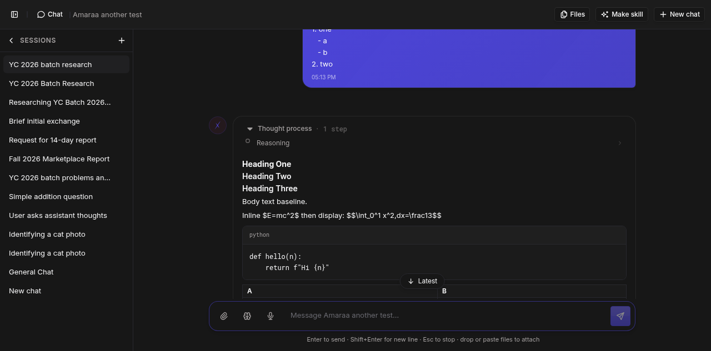
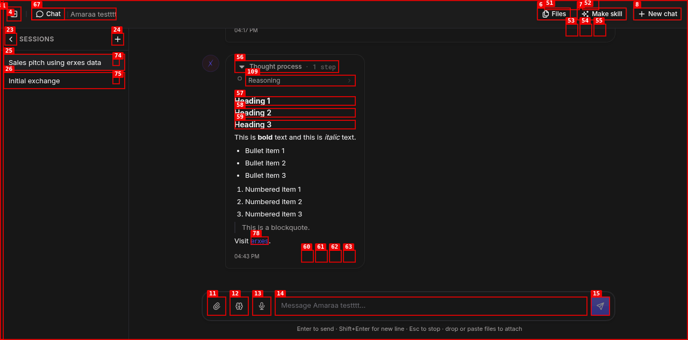
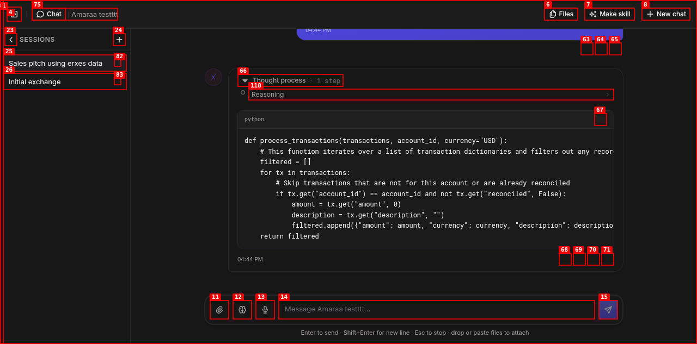
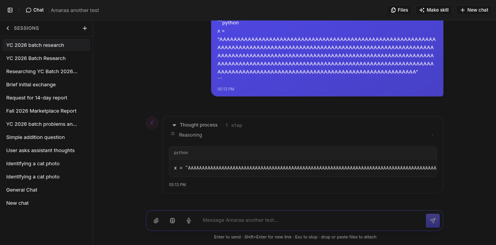
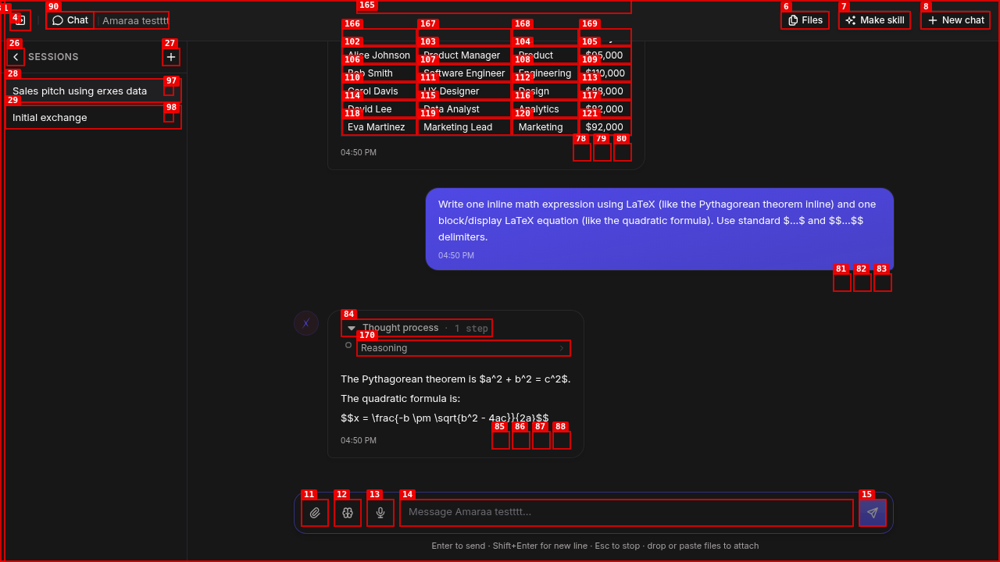

# Dogfood Report: erxes AI Agent — Chat Message Rendering (code-grounded)

| Field | Value |
|-------|-------|
| **Date** | 2026-07-01 |
| **App URL** | http://localhost:3001/erxes-agent/chat |
| **Session** | render (isolated headless `/tmp/abw-render`) |
| **Scope** | Chat message markdown rendering: headings, code, LaTeX, tables, links, blockquotes, lists, task lists, overflow, light/dark |
| **Agent used** | "Amaraa another test" (kimi-for-coding) — assigned agent, no cross-agent contamination |
| **Pipeline grounded in** | `frontend/plugins/erxes-agent_ui/src/modules/chat/components/ChatMarkdown.tsx` |

## Pipeline (ground truth)

Assistant markdown is rendered by `ChatMarkdown.tsx`. The `react-markdown` instance (`MarkdownBlock`, ChatMarkdown.tsx:211-225) is configured with **only** two plugins:

```
remarkPlugins={[remarkGfm]}          // ChatMarkdown.tsx:217
rehypePlugins={[rehypeSanitize]}     // ChatMarkdown.tsx:218
```

Grep of `plugins/erxes-agent_ui/src` and the frontend root `package.json` finds **no** `remark-math`, `rehype-katex`, `rehype-highlight`, `shiki`, `prismjs`, or `highlight.js`. The three primary findings all trace to this two-plugin configuration + the component-level overrides in `components` (ChatMarkdown.tsx:148-206).

## Summary

| Severity | Count |
|----------|-------|
| Critical | 0 |
| High | 0 |
| Medium | 3 |
| Low | 0 |
| **Total** | **3** |

Non-bugs investigated & cleared: 6 (see bottom).

## Issues

### RENDER-001: Markdown heading levels (h1/h2/h3) render at identical 14px — no visual size hierarchy

| Field | Value |
|-------|-------|
| **Severity** | medium |
| **Category** | visual |
| **Repro Video** | N/A (static) |

**Reproduced.** Sent markdown with `# Heading One`, `## Heading Two`, `### Heading Three`. Live computed styles inside the rendered assistant bubble:

| Element | font-size | font-weight | margin-top |
|---------|-----------|-------------|-----------|
| `h1` | **14px** | 700 | 4px |
| `h2` | **14px** | 600 | 4px |
| `h3` | **14px** | 600 | 4px |
| body `<p>` | 13px | 400 | — |

All three headings render at the same 14px. **`h2` and `h3` are pixel-identical** (14px / weight 600 / mt-1) — there is zero visual difference between them. `h1` differs only by weight (700 vs 600). No size hierarchy; a `# H1` looks the same size as a paragraph.

**Code grounding — `ChatMarkdown.tsx`:**
- Line 147 comment states the design intent explicitly: *"weight-based heading hierarchy"* — hierarchy is by font-weight, not size.
- `h1` → `text-base font-bold` (line 171-173)
- `h2` → `text-base font-semibold` (line 176)
- `h3` → `font-semibold` with **no size class** (line 177) → inherits the container size
- Container is `text-sm` (14px) — ChatMarkdown.tsx:237 / StreamingMarkdown:255.

Root cause: hierarchy was deliberately made weight-based, and h3 was given no size class. The `text-base` (nominally 16px) on h1/h2 does **not** take effect in the rendered chat context (all measured at 14px), so even the minimal intended size bump is lost and h2≡h3. Whether this is filed as a bug is a judgement call given the intentional weight-based design, but the observable outcome (h2 and h3 indistinguishable, headings not scannable) is a real UX defect for markdown content.

**Evidence**




---

### RENDER-002: Fenced code blocks have NO syntax highlighting despite a language label

| Field | Value |
|-------|-------|
| **Severity** | medium |
| **Category** | visual |
| **Repro Video** | N/A (static) |

**Reproduced.** A ```` ```python ```` block renders with a `python` label in the header bar, but the code is one flat monochrome color. Live DOM inspection of the `<code>` element:

- `code.querySelectorAll('span').length` = **0** (no token spans)
- `code.childElementCount` = **0** — the `<code>` contains a raw text node only (`def hello(n):\n    return f"Hi {n}"`)
- language label element with text `python` present = **1**

**Code grounding — `ChatMarkdown.tsx`:**
- `CodeBlock` renders the body as `<pre className="...font-mono..."><code>{code}</code></pre>` — a raw string child, no tokenizer (lines 139-141).
- The header shows the language label `{lang || 'code'}` (lines 135-137) — hence the "python" label with no matching highlighting.
- `MarkdownBlock` wires no highlighter plugin (rehypePlugins is `[rehypeSanitize]` only, line 218).
- No `shiki` / `prismjs` / `rehype-highlight` / `highlight.js` dependency anywhere in the plugin src or root `package.json`.

For a coding-focused agent (`kimi-for-coding`), unhighlighted code hurts readability. Expected: tokenized highlighting matching the advertised language.

**Evidence**




---

### RENDER-003: LaTeX math is not rendered — shown as raw `$...$` / `$$...$$` source

| Field | Value |
|-------|-------|
| **Severity** | medium |
| **Category** | functional |
| **Repro Video** | N/A (static) |

**Reproduced.** Sent `Inline $E=mc^2$ then display: $$\int_0^1 x^2\,dx=\frac13$$`. Both appear verbatim as text. Live DOM check:

- body text still contains literal `$E=mc^2$` = **true**
- body text still contains raw `\int` / `\frac` = **true**
- `.katex, mjx-container` node count = **0** → no math renderer present.

**Code grounding — `ChatMarkdown.tsx`:**
- `remarkPlugins={[remarkGfm]}` (line 217) — no `remark-math`, so `$...$` / `$$...$$` are never parsed into math nodes.
- `rehypePlugins={[rehypeSanitize]}` (line 218) — no `rehype-katex`, so nothing converts math to KaTeX markup.
- No `katex` / `remark-math` / `rehype-katex` dependency in plugin src or root `package.json`.

Any math/scientific answer is unreadable. Expected: `$...$` → inline math, `$$...$$` → centered display equation.

**Evidence**




---

## Non-bugs — investigated and cleared

All grounded in code + verified in browser this session.

1. **Copy-code button works.** `CopyButton` (CopyButton.tsx:7-40) calls `navigator.clipboard.writeText(text)` and toggles to a green `IconCheck` + "Copied!" tooltip for 1.5s. Rendered in the code header, revealed on hover (`opacity-0 group-hover/code:opacity-100`, ChatMarkdown.tsx:135). Button present and clickable (1 button in code header). Note: the copied-state toggle did not fire in headless Chrome because `navigator.clipboard` is blocked without a granted permission — an environment artifact, not an app defect.
2. **Long-line horizontal scroll stays inside the bubble.** Sent a 300-char single code line: `pre` computed `overflow-x:auto` (ChatMarkdown.tsx:139), `scrollWidth 2228 > clientWidth 690` (internal scroll active), `pre.right 1127 ≤ bubble.right 1128`, and `document.scrollWidth == clientWidth` (no page overflow). Code stays within the bubble. ✓
3. **Very long URL wraps inside the bubble.** Link computed `overflow-wrap:break-word` (container `break-words`, ChatMarkdown.tsx:237); link right 1070 ≤ container right 1128, no page overflow. ✓
4. **Tables render.** GFM table renders with bordered cells, `text-xs`, `overflow-x-auto` wrapper (ChatMarkdown.tsx:193-205). ✓
5. **Blockquotes & nested lists render.** Blockquote → `border-l-2 pl-3 text-muted-foreground` (lines 188-192); nested ordered/unordered lists render with correct indentation (lines 164-170). ✓
6. **Task lists render.** GFM `- [x]` / `- [ ]` render as **disabled** checkboxes with correct checked state (checkbox 1 checked+disabled, checkbox 2 unchecked+disabled). ✓

## Notes

- **User messages are shown as plain text, not markdown** (the user bubble displayed literal ```` ``` ```` fences). Investigated — this is by design; `ChatMarkdown`/`StreamingMarkdown` are applied to assistant output, and the scope here is assistant rendering. Not filed.
- No console errors or `errors` output were produced by any rendering step this session (only benign HMR / React-DevTools / Apollo dev logs).
