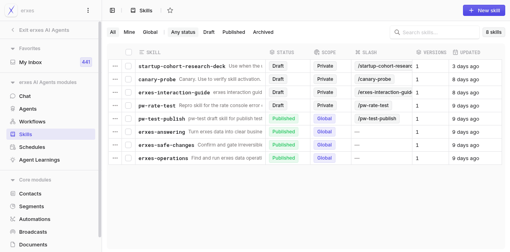
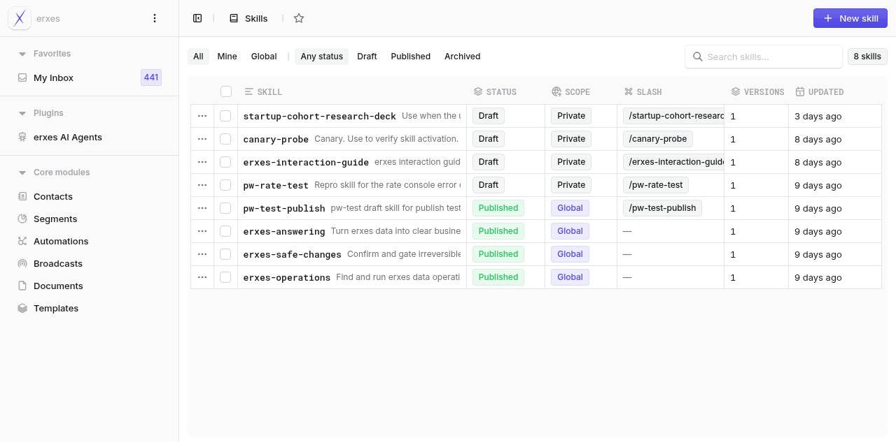

# Dogfood Report: erxes AI Agent — Skills

| Field | Value |
|-------|-------|
| **Date** | 2026-07-01 |
| **App URL** | http://localhost:3001/erxes-agent/skills |
| **Session** | ab-df-skills |
| **Scope** | Skills area only (list, detail, create, edit, delete) |

## Summary

| Severity | Count |
|----------|-------|
| Critical | 0 |
| High | 0 |
| Medium | 0 |
| Low | 0 |
| **Total** | **0** |

## Issues

### ISSUE-001: Reloading the Skills page loses the entire "erxes AI Agents" console navigation shell

| Field | Value |
|-------|-------|
| **Severity** | medium |
| **Category** | functional / ux |
| **URL** | http://localhost:3001/erxes-agent/skills |
| **Repro Video** | /home/darjs/dev/os/erxes/dogfood-output/skills/videos/issue-shell-desync.webm |

**Description**

The Skills page lives inside a dedicated "erxes AI Agents" console shell whose left sidebar exposes the whole module: Chat, Agents, Workflows, Skills, Schedules, Agent Learnings (plus an "Exit erxes AI Agents" button). This shell only mounts when you navigate INTO it in-app (e.g. click the "erxes AI Agents" plugin entry). If you hard-reload (or deep-link/bookmark) the exact same URL `/erxes-agent/skills`, the app renders a *generic* plugin shell instead: the dedicated AI-Agents nav (Chat/Agents/Workflows/Schedules/Agent Learnings) is gone, replaced by a collapsed "erxes AI Agents" button under a generic "Plugins" group. A user who reloads the page has no visible way to reach the other AI-Agents sections without first clicking back into the plugin — the navigation context silently disappears on refresh.

**Repro Steps**

1. From the generic erxes shell, click "erxes AI Agents" → the dedicated console loads with the full AI-Agents sidebar (Chat/Agents/Workflows/Skills/Schedules/Agent Learnings, "Exit erxes AI Agents").
   

2. Reload / hard-navigate to `http://localhost:3001/erxes-agent/skills`. The dedicated AI-Agents sidebar is gone; a generic "Plugins / Core modules" sidebar renders instead (no Chat/Agents/Workflows/Schedules/Agent Learnings links).
   

**Observe:** Same URL, two different navigation shells depending on how it was reached. Reloading strips the AI-Agents module navigation.

---
